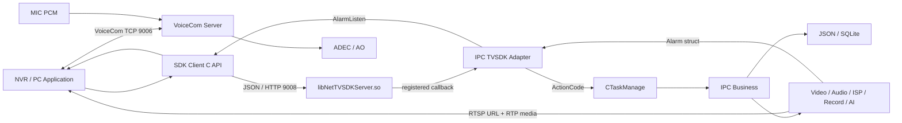

# IPC_Camera AI 项目上下文手册

> 适用对象：Claude、Codex、ChatGPT、Copilot 等需要快速理解并协助维护本仓库的 AI。
>
> 文档目标：让 AI 在较短上下文内建立正确的模块边界、运行模型、调用链和排障顺序，避免只根据符号名猜测实现。
>
> 快照说明：本文基于当前工作区源码与 `pasted-test.txt` 整理。仓库包含大量未提交改动、历史构建产物和多平台副本；任何修改前都必须重新读取当前源码并检查工作区状态。

## 1. 给 AI 的首要规则

1. 先确认问题属于 Hi3516、RV1126、SDK Client、SDK Server、IPC TVSDK、公共协议合同还是目标机部署环境。
2. 结论必须落到真实文件、类、函数、命令码、结构体或运行路径，不能只给通用 IPC/音视频知识。
3. 文档用于建立地图，源码才是当前事实。文档与代码冲突时，以当前源码、实际构建脚本和目标机加载的二进制为准。
4. 不要把 SDK Server 当成独立进程。Hi3516 侧实际把 `libNetTVSDKServer.so` 链接/加载进 `stream` 主进程。
5. 不要把 TVSDK 当成音视频传输框架。TVSDK 主要承载 HTTP 控制、配置、会话、告警与协议适配；实时预览通常返回 RTSP 地址，媒体随后走 RTSP/RTP。
6. 不要把 VoiceCom 和普通对讲状态混为一谈。VoiceCom 媒体走独立 TCP 9006；`NET_TV_STATE_TALKBACK` 是控制状态，最终进入 `AC_SET_INTERCOM_INFO`。
7. 修改 SDK/TVSDK 接口时必须同时检查 Client、Server、公共结构体、JSON 转换、IPC 回调、ActionCode、Task、Business、生成头文件和动态库，不能只改同名函数。
8. 当前工作树很脏。保留用户已有修改，不要重置、覆盖或顺手格式化无关文件。
9. 不要优先搜索 `build/output`、`output`、工具链头文件、HTML API 文档和二进制目录；先在源码目录定位，再用生成产物做 ABI/发布校验。
10. 对“接口成功但业务失败”“回调后崩溃”“只在设备上失败”这三类问题，优先怀疑返回值传播、结构体 ABI/数组边界、部署二进制与源码不一致。

## 2. 60 秒项目模型

`IPC_Camera` 是一套嵌入式网络摄像机产品工程，核心由三条链组成：

- 媒体数据面：Sensor/MIC 产生视频和音频，经海思 MPP 编码后送 RTSP、GB28181、录像、AI 或扬声器。
- 业务控制面：Web、ONVIF、TVSDK、平台协议把请求转换为 `ActionCode`，由 `CTaskManage` 分发给业务管理类。
- SDK 对接面：外部 NVR 调用 SDK Client C API；Client 通过 JSON/HTTP 访问设备内的 SDK Server；SDK Server 调用 IPC TVSDK 注册的回调；IPC TVSDK 再进入控制总线。



## 3. 仓库源码地图

| 路径 | 角色 | AI 首选入口 |
|---|---|---|
| `Hi3516/hi3516_ipc` | Hi3516 设备应用、构建与进程 | `main_app/stream_main.cpp`、`main_app/stream_media` |
| `Hi3516/hi_pipeline` | 海思 MPP/SVP/Cipher 封装 | `mpp/vi`、`mpp/vpss`、`mpp/venc`、`mpp/ai`、`mpp/ao` |
| `Hi3516/share/ipc_share` | IPC 公共业务、控制总线、协议、推流 | `control`、`protocols/tvsdk`、`push_stream` |
| `Hi3516/share/cam_share` | 通用摄像机能力和 live555 封装 | `media/live555/mediaServer` |
| `Hi3516/share/ai_share` | AI 推理后端和算法库 | 按具体算法搜索，不要全树扫描 |
| `Hi3516/ipc_platform` | 目标库、rootfs、启动脚本和部署环境 | `environment/system`、`lib/tvsdk`、`build` |
| `SDK/af_sdk/sdk_share` | Client/Server 公共协议合同和 JSON 转换 | `include/NetTVSDKCommon.h`、`tools/convert` |
| `SDK/af_sdk/sdk_server` | 设备侧 SDK HTTP、Session、路由和回调执行 | `src/service`、`src/business`、`src/interface` |
| `SDK/af_sdk/sdk_client` | NVR/PC 侧登录、HTTP、告警和 VoiceCom | `src/core`、`src/interface`、`demo` |
| `SDK/af_sdk/build` | SDK 多平台构建、合并头和打包 | `build.sh`、`server/CMakeLists.txt`、`client/CMakeLists.txt` |
| `rv1126` | Rockchip 平台平行实现 | 仅在问题明确涉及 RK 或跨平台同步时进入 |

### 3.1 搜索时默认排除

- `SDK/af_sdk/build/output`
- `Hi3516/output`
- `Hi3516/hi3516cv610/rootfs*`
- `Hi3516/ipc_platform/lib` 中无源码的 `.so/.a`
- `docs/helpndoc_*`
- 工具链系统头、第三方测试和已生成对象文件

这些目录适合验证发布包、符号、依赖和 ABI，不适合用来判断业务源码的所有权。

### 3.2 事实优先级

从高到低建议采用：

1. 当前请求对应的实现 `.cpp/.c` 和头文件。
2. 真实 CMake/构建脚本及其选择的平台宏。
3. SDK 公共源头头文件与注册表。
4. 当前目标机加载的 ELF、动态库、配置和日志。
5. 生成头、构建目录和 Demo。
6. 本文、其他 Markdown 和 HTML API 文档。

## 4. 设备运行与生命周期

Hi3516 主入口是 `Hi3516/hi3516_ipc/main_app/stream_main.cpp`。

当前初始化顺序：

```text
CConfigManager
  -> CCryptoInit
  -> CStreamVideo
  -> CStreamAudio
  -> CPushStream
  -> ControlManage
```

退出按相反顺序执行。这里的顺序表达了依赖关系：控制协议依赖业务和媒体对象，推流依赖音视频生产者，音视频依赖配置与硬件资源。排查退出卡死时，要从反初始化顺序、线程 `join()` 和阻塞式 MPP 取帧接口入手。

设备启动脚本位于 `Hi3516/ipc_platform/environment/system/etc/init.d/S81appinit`，常见进程包括：

| 进程 | 职责 |
|---|---|
| `stream` | 音视频、AI、协议和控制核心 |
| `record` | 录像接收、封装、文件和索引 |
| `upgrade` | 升级执行和状态持久化 |
| `operation` | 运维日志 |
| `daemon` | 进程守护 |

## 5. 音视频数据面

### 5.1 视频链路

核心入口：

- `Hi3516/hi3516_ipc/main_app/stream_media/video/stream_video.cpp`
- `Hi3516/hi3516_ipc/main_app/stream_media/video/venc_channel_handler.cpp`
- `Hi3516/share/ipc_share/push_stream/push_stream.cpp`
- `Hi3516/share/ipc_share/push_stream/rtsp/rtsp_server.cpp`

主链路：

```text
Sensor
  -> VI
  -> ISP
  -> VPSS Group
       -> Main Channel -> VENC Main -> RTSP/RTMP + GB28181 + Record
       -> Sub Channel  -> VENC Sub  -> RTSP/RTMP + optional Record
       -> AI Channel   -> YUV frame -> AI_APP
       -> JPEG path    -> VENC JPEG -> CaptureCtrl
```

`CStreamVideo::init()` 负责 MPP SYS/VB、VI、ISP、VPSS、主/子/JPEG VENC、线程、OSD 和模块 bind。当前会创建主码流、子码流、JPEG 三个 VENC 取流线程，并创建一个 VPSS AI 取帧线程。

`CStreamVideo::get_vencStream()` 从 VENC 取得 pack，组装 `VideoFrame_S`，解析 H.264/H.265/SVAC3/MJPEG 帧类型，再交给不同 `VencChannelHandler`。主、子码流的下游消费者不同，所以“编码有帧”不等于“RTSP、录像和国标都正常”。

`CStreamVideo::get_vpssStream()` 从 AI 通道取得 YUV420，当前按约每 10 帧取一帧送算法。预览正常但 AI 无结果时，优先检查 VPSS AI 通道、物理地址映射、抽帧条件、算法实例和事件联动，而不是 VENC。

AI 路径会把映射后的 VPSS YUV 再复制到 AI 自己的帧/VB，并非零拷贝；算法常用容量 2 的队列并在满时丢最旧帧。当前历史构建画像是 `TV-3852T + sc533hai-f4mm`，其中录像使用子码流，垃圾检测和人流统计能力关闭。回答能力问题时必须同时读设备画像宏。

视频配置热更新由 `CStreamVideo::setVideoConfig()` 执行，可能涉及停止 VENC 线程、解绑 VPSS→VENC、修改 VPSS/wrap/裁剪、重建 VENC、重绑、请求 IDR、更新 RTSP/OSD/录像/RTMP。因此 SDK 的一个视频 SET 请求可能同步触发较重的媒体重配置。

### 5.2 RTSP 与 live555

项目业务代码没有直接到处调用 live555，而是通过 `CRtspServer` 和 `rtspServer_base` 封装。

```text
VENC/AENC producer
  -> CRtspServer bounded queue
  -> live555 custom FramedSource::doGetNextFrame
  -> dataGetfun / rtspFrameCall
  -> afterGetting(this)
  -> RTPSink
```

这是一种生产者写队列、live555 Source 按需拉取的模型。URL 主要为：

- `/Streaming/Channels/101`：主码流。
- `/Streaming/Channels/102`：子码流。

RTSP 黑屏的排查顺序应是：VENC 是否取到帧 → NAL 类型/I 帧是否正确 → `CPushStream` 是否送入 → RTSP client request 状态 → 队列是否清空/丢帧 → live555 Source 是否拉取 → RTP 是否发出。

当前普通型号每路 RTSP 队列只有 4 个视频帧和 4 个音频帧，最多 4 个客户端；新客户端会请求 IDR，并在关键参数集到来前丢弃普通帧。

### 5.3 音频链路

核心入口：`Hi3516/hi3516_ipc/main_app/stream_media/audio/stream_audio.cpp`。

```text
MIC / LINEIN
  -> AI capture
  -> PCM preprocess / volume / mono
  -> AENC AAC
  -> RTSP + Record

PCM branch
  -> VoiceCom capture buffer
  -> Audio AI
  -> optional resample + G711

Talkback / VoiceCom payload
  -> PCM direct or G711 software decode or AAC ADEC
  -> AO / Speaker
```

关键线程：

- `deal_aiFrame_thr()`：采集 PCM，做输入选择、单声道、音量、VoiceCom 缓存、AENC/AI/G711 分发。
- `deal_aencFrame_thr()`：取得 AAC，识别并去除 ADTS 头，把裸 AAC 送 RTSP，把音频负载送录像。

`sendAudio_to_Adec()` 支持 PCM、G711A、G711U 和 AAC。PCM/G711 最终送 AO；AAC 进入 ADEC 后通过 ADEC→AO 播放。

AI→AENC 当前没有硬件 bind；音频采集线程在选择输入、单声道整理和调音量后手工把 PCM 送入 AENC。因此 AAC 无数据要同时检查 AI 采集线程和 `mppAenc_sendFrame()`。

### 5.4 录像与回放

录像由独立 `record` 进程完成：`stream` 经 TCP 10001 发送编码音视频，record 使用 FFmpeg 直接 remux 为 MPEG-TS，按 60 秒和关键帧切片并维护 m3u8。回放主路径是录像查询 + Nginx 静态 HLS，不是 live555 RTSP 回放。直播正常但回放失败时，应优先检查 record、TS/m3u8、录像数据库和 Nginx。

### 5.5 VoiceCom 与对讲状态

VoiceCom 是独立媒体通道：

```text
TCP 9006
[2-byte big-endian length][payload]
first payload = "VCP1" + audio parameters
later payload = raw PCM/G711A/G711U
```

下行：

```text
NET_TV_StartVoiceCom / NET_TV_VoiceComSendData
  -> VoiceComClient
  -> VoiceComServer recv loop
  -> cb_voice_com_play
  -> CAVConfigure::setAoSpeakInfo
  -> CStreamAudio::sendAudio_to_Adec
  -> AO
```

上行：

```text
MIC PCM
  -> VoiceCom capture source/buffer
  -> cb_voice_com_capture
  -> VoiceComServer capture loop
  -> TCP 9006
  -> VoiceComClient receive callback
```

`NET_TV_STATE_TALKBACK` 则进入：

```text
cb_set_talkback_state
  -> AC_SET_INTERCOM_INFO
  -> PreviewManage::set_intercom_info
```

当 SDP 标记为 `tvsdk_voicecom` 且 URL 为空时，Preview 层跳过 RTP Receiver，因为媒体已经走 VoiceCom TCP。排障时必须分别证明“状态设置成功”和“9006 音频收发成功”。

## 6. IPC 控制总线

核心文件：

- `Hi3516/share/ipc_share/control/control_manage.cpp`
- `Hi3516/share/ipc_share/control/task/task_manage.cpp`
- `Hi3516/share/ipc_share/control/task/task.cpp`
- `Hi3516/share/ipc_share/common/action_code.h`

`ControlManage` 创建业务对象、协议服务和 `CTaskManage`，再通过 `bind_task()` 把 `ActionCode` 绑定到 Task。

```text
Protocol Adapter
  -> CTaskManage::execute(actionCode, Task::Info_S)
  -> Task::set_info
  -> Task::handle
  -> Business Manager
  -> result callback / JSON
```

常见映射示例：

```text
AC_GET_VIDEO_CONFIG -> Task::AV::GetVideoConfig
AC_SET_VIDEO_CONFIG -> Task::AV::SetVideoConfig
AC_GET_TIME_INFO     -> Task::System::GetTimeInfo
AC_SET_TIME_INFO     -> Task::System::SetTimeInfo
AC_SET_INTERCOM_INFO -> Preview/Talkback business
```

重要风险：Task 通常按 ActionCode 长期复用，不一定每个请求新建对象。调查同一命令并发、5 秒超时、结果串包或偶发错误时，要检查共享 Task 状态、`set_info()`、队列排序、锁范围和 `result()` 对应关系。

## 7. SDK 三层结构

### 7.1 sdk_share：协议合同

`SDK/af_sdk/sdk_share` 同时被 Client 和 Server 使用，包含：

- `NetTVSDKCommon.h`：公共枚举、命令码、固定结构体、数组上限。
- `NetTVSDKHttpUrl.h`：HTTP URL 合同。
- `tools/convert`：结构体与 JSON 的双向转换。
- JSON、Base64、日志和发现协议等公共工具。

这是 ABI 和线协议的核心。固定数组长度、枚举值、字段顺序、字节宽度和图片长度字段必须在所有参与方一致。

### 7.2 SDK Server：设备内 HTTP 框架

核心入口：

- `SDK/af_sdk/sdk_server/src/interface/NetTVSDKServerInterface.cpp`
- `SDK/af_sdk/sdk_server/src/interface/NetTVSDKServerImpl.cpp`
- `SDK/af_sdk/sdk_server/src/service/SdkHttpServer.cpp`
- `SDK/af_sdk/sdk_server/src/service/RouteRegistry.h`
- `SDK/af_sdk/sdk_server/src/business/DeviceConfigBusiness.h`
- `SDK/af_sdk/sdk_server/src/cb/config/NetTVConfigCb.c`

`NET_TV_SERVER_Init()` 初始化 Session、路由和 HTTP Server。HTTP 基于 `httplib::Server`，当前固定 16 个工作线程，读超时 300 秒、写超时 30 秒，并配置 keep-alive。路由通过静态注册表安装。

主要端点：

| URL | 方法 | 作用 |
|---|---|---|
| `/TVAPI/V1.0/Basic/Login` | POST | 登录和 Session |
| `/TVAPI/V1.0/Basic/Logout` | POST | 注销 |
| `/TVAPI/V1.0/Basic/KeepLive` | GET | 保活 |
| `/TVAPI/V1.0/Device/GetInfo` | GET | 设备信息 |
| `/TVAPI/V1.0/Device/Capability` | GET | 能力集 |
| `/TVAPI/V1.0/Device/GetDevConfig` | GET | 获取配置 |
| `/TVAPI/V1.0/Device/SetDevConfig` | POST | 设置配置 |
| `/TVAPI/V1.0/Event/AlarmListen` | GET | 告警长连接 |

`DeviceConfigBusiness` 的模板通常执行：按 Command 选择结构体类型 → 调用注册回调 → 把结构体序列化为 JSON。若日志显示 IPC 回调已成功、随后服务端崩溃，应立即转向 SDK serializer、结构体布局、数组上限和 JSON 所有权，而不是继续只盯 IPC 回调。

普通业务路由每次执行 Basic/Digest 鉴权，但不校验 SDK `session_id`。Session 目前主要用于 KeepLive、AlarmListen、在线计数和告警队列。AlarmListen 不是真正 SSE，而是 chunked multipart；每连接占 16 线程池中的一个 worker。每 Session 队列只按“100 条”限流，不按总字节数限流，带 Base64 图片的大告警可能造成明显内存压力。

`NET_TV_SERVER_Cleanup()` 不会自动停止独立的 VoiceCom 和 RecordFrame TCP Server。路由静态注册器也使同进程第二次 Init 存在大量业务路由无法恢复的风险。

### 7.3 SDK Client：调用方封装

核心入口：

- `SDK/af_sdk/sdk_client/src/interface/NetTVSDKClientInterface.cpp`
- `SDK/af_sdk/sdk_client/src/core/DeviceManage.cpp`
- `SDK/af_sdk/sdk_client/src/core/UserSession.cpp`
- `SDK/af_sdk/sdk_client/src/core/CommandExecutor.h`
- `SDK/af_sdk/sdk_client/src/core/ClientAlarmManager.cpp`
- `SDK/af_sdk/sdk_client/src/core/VoiceComClient.cpp`

标准生命周期：

```text
NET_TV_Init
  -> NET_TV_Login
  -> business APIs / alarm callback / VoiceCom
  -> NET_TV_Logout
  -> NET_TV_Cleanup
```

Client 的公开 C 结构体不是网络二进制直传。配置接口会把结构体转换为 JSON，经 HTTP 发给 Server，再把响应 JSON 还原为结构体。登录后 `UserSession` 保存 SessionId 并运行心跳/重连；`ClientAlarmManager` 维护 AlarmListen 长连接并把 JSON 告警还原为固定结构体。

当前 Client 还有几个必须知道的行为：`NET_TV_Logout()` 只清理本地 Session，不调用服务端 Logout；401 处理会在持有 `cmdMutex_` 时等待同样需要该锁的重连线程，可能固定等待约 30 秒；AlarmLoop 在阻塞无法退出时会 detach，存在对象销毁后的访问风险。告警回调运行在 SDK 接收线程，回调参数只在当次调用期间有效。

## 8. IPC TVSDK 适配层

核心文件：

- `Hi3516/share/ipc_share/protocols/tvsdk/src/tvsdk_server.cpp`
- `Hi3516/share/ipc_share/protocols/tvsdk/src/callbacks/tvsdk_callbacks.cpp`
- `Hi3516/share/ipc_share/protocols/tvsdk/src/convert/tvsdk_convert.cpp`
- `Hi3516/share/ipc_share/protocols/tvsdk/include/NetTVSDKServer.h`

默认控制端口 `IN_CONTROL_SDK_PROT` 为 9008。`CTvSdkServer::init()` 的实际步骤是：

1. 从用户管理获取管理员账号和密码。
2. 调用 `NET_TV_SERVER_Init(9008, user, pass)`。
3. 把 `CTaskManage` 注入回调模块。
4. `TvSdkCallbacks::register_all()` 注册 SDK Server 回调。
5. 启动 VoiceCom 9006。
6. 注册并启动设备发现。

适配层应该只负责：

- SDK Command 与 IPC ActionCode 对应。
- SDK 固定结构体与 IPC JSON/业务结构体转换。
- SDK 错误与 IPC 返回码对应。
- 告警结构体构造和推送。

适配层不应该重新实现业务规则，也不应该绕开 `CTaskManage` 直接修改媒体/配置，除非该功能本身就是独立媒体通道，例如 VoiceCom。

## 9. 五条必须会背的端到端链路

### 9.1 GET：NTP 配置

```text
NET_TV_GetDevConfig(NET_TV_GET_NTPCFG)
  -> SDK Client CommandExecutor + HTTP GET
  -> SDK Server DeviceConfigBusiness::HandleGetConfig<NET_TV_SYSTEM_NTP_INFO_S>
  -> NetSDK_ExecuteCb_GetDevConfig
  -> IPC cb_get_ntp_cfg
  -> AC_GET_TIME_INFO
  -> Task::System::GetTimeInfo
  -> CTimeManage / time config
  -> IPC result JSON
  -> TvSdkConvert::FillSystemNtpInfo
  -> SDK Server JSON serializer
  -> SDK Client JSON parser
  -> caller struct
```

四个检查点：Task JSON、转换后的 SDK 结构体、Server HTTP Body、Client 输出结构体。

### 9.2 SET：视频编码配置

```text
NET_TV_SetDevConfig(NET_TV_SET_STREAMCFG)
  -> Client struct-to-JSON
  -> HTTP POST
  -> Server HandleSetConfig<NET_TV_VIDEO_ENCODE_OPTION_S>
  -> registered set callback
  -> IPC cb_set_stream_cfg
  -> TvSdkConvert::ToVideoConfig
  -> AC_SET_VIDEO_CONFIG
  -> Task::AV::SetVideoConfig
  -> CAVConfigure
  -> CStreamVideo::setVideoConfig
  -> VPSS/VENC/RTSP reconfigure + persistence
```

必须验证接口返回、配置回读、运行态媒体参数和重启后持久化，不能只看 HTTP 200/SDK TRUE。

### 9.3 告警推送

```text
AI / normal event
  -> EventLinkage / algorithm SDK event publisher
  -> NET_TV_ALARM_*_INFO_S
  -> ControlManage::tvsdk_push_alarm
  -> CTvSdkServer::push_alarm
  -> NET_TV_SERVER_PushAlarmInfo
  -> AlarmModule JSON/Base64
  -> Session queue
  -> AlarmListen multipart stream
  -> ClientAlarmManager
  -> application alarm callback
```

图片通常作为告警结构体中的内存缓冲区，在 JSON 中 Base64 传输。事件时间戳字段是 Unix epoch 毫秒，不是格式化时区字符串。无推送时检查事件是否被过滤、在线 Session 数、结构体类型/长度、序列化、Session 队列和 Client 长连接。

### 9.4 实时预览

```text
SDK get preview / RTSP URL
  -> IPC preview business
  -> return rtsp://device/Streaming/Channels/101 or 102
  -> caller creates RTSP session
  -> live555 control plane
  -> FramedSource pulls VENC/AENC queue
  -> RTP media
```

SDK HTTP 只负责取地址/配置，不承载持续视频帧。

### 9.5 VoiceCom

```text
HTTP/config state: NET_TV_STATE_TALKBACK -> AC_SET_INTERCOM_INFO
media downlink: SDK Client -> TCP 9006 -> play callback -> AO
media uplink: MIC PCM -> capture callback -> TCP 9006 -> SDK Client
```

任何 VoiceCom 问题都要分别检查状态面、TCP 连接、参数首帧、下行播放和上行采集。

## 10. ABI、生成头和动态库

仓库里可能同时存在：

- `SDK/af_sdk/sdk_share/include/NetTVSDKCommon.h`
- `SDK/af_sdk/sdk_server/include/NetTVSDKServerInterface.h`
- `SDK/af_sdk/sdk_client/include/NetTVSDKClientInterface.h`
- `SDK/af_sdk/build/server/include` 与 `build/client/include` 的合并发布头
- IPC 自带的 `Hi3516/share/ipc_share/protocols/tvsdk/include/NetTVSDKServer.h`
- `Hi3516/ipc_platform/lib/tvsdk/lib/libNetTVSDKServer.so`
- SDK build 目录内多个架构的 `.so/.a`

这些副本不自动保持一致。出现以下症状时必须做 ABI 审计：

- 回调执行完后崩溃。
- GET 返回全零、乱码或数组越界。
- Client/Server 编译都成功，但目标机异常。
- 同一接口在 linux64 Demo 正常、Hisi32 设备异常。

审计内容包括：函数签名、调用约定、`sizeof`、结构体对齐、枚举宽度、固定数组上限、指针/值传递、导出符号、动态库依赖和目标机实际加载路径。

当前快照还有一个重要证据：`Hi3516/hi3516_ipc/main_app/CMakeLists.txt` 中 `libNetTVSDKServer` 链接项被注释，但已有 `Hi3516/output/bin/stream` 的 ELF 依赖仍包含 `libNetTVSDKServer.so`。AI 不应据此武断判断某一方正确，而应将其识别为“源码/CMake 与历史产物不一致”，并要求干净构建、链接命令和 `readelf -d` 三方核对。

当前两个 Hisi32 Server SO 的 SHA256 不同，平台库有 189 个 `NET_TV_SERVER_*` 导出，SDK build 库有 195 个。平台库缺少 DeviceControl 注册和 5 个 RecordFrame Server/callback 导出；IPC 本地 Server 头和 SDK 生成 Server 头也不是同一文件。AI 遇到新接口“不支持”或链接失败时，应先核对这套版本矩阵，而不是立刻补业务代码。

## 11. 已知高风险区域

以下是优先审查点，不代表可以不看现场证据直接修改：

| 风险 | 典型症状 | 首查位置 |
|---|---|---|
| 公共头、生成头和 `.so` 漂移 | 回调后崩溃、字段错位 | SDK/IPC 头、目标库、`readelf` |
| 固定数组/长度字段越界 | OSD、告警图片、区域配置崩溃 | 公共结构体、convert、serializer |
| `malloc` 与 `delete` 混用 | 长时间运行后堆损坏 | `stream_video.cpp`、`stream_audio.cpp` |
| 同 ActionCode 共享 Task 状态 | 并发超时、结果串包 | `task_manage.cpp`、`task.cpp` |
| SET 业务返回值未完整传播 | SDK 成功但配置未生效 | callback、Task、Business、持久化 |
| 网络 GET/SET 信封错误 | GET 全零、SET 空数据 | `cb_get_network_cfg`、`cb_set_network_cfg` |
| 音频能力未提取 `Data` | 能力结构全零但返回成功 | `cb_get_audio_encode_cap` |
| TVSDK 升级 Task 固定失败 | Set/Check 阶段必失败 | `system_task.cpp`、`cb_set_upgrade` |
| callback 已实现但未注册 | Wi-Fi/4G/热点不进 IPC | `register_all` |
| 对讲流 ActionCode 未绑定 | 3201/3202/3203 直接失败 | `ControlManage::bind_task` |
| 阻塞取帧与退出顺序 | 退出卡死、join 不返回 | MPP get frame/stream、deinit |
| 音频启动/缓存边界 | 偶发无音、重采样异常 | `CStreamAudio::init()`、vector 使用 |
| SDK Cleanup 后二次 Init | 单例或路由无法恢复 | Singleton、RouteRegistry、Init/Cleanup |
| Client Logout 不通知 Server | 客户端数延迟下降、残留 Session | `DeviceManage.cpp`、`SessionManager.cpp` |
| 401 重连持锁等待 | 命令固定等待约 30 秒后失败 | `UserSession::SendRequest/ReconnectLoop` |
| 告警线程 detach | Cleanup/重复监听后随机崩溃 | `ClientAlarmManager::Stop` |
| VoiceCom 无 Session 绑定或调试 dump | 安全、性能、隐私 | `VoiceComServer`、`tvsdk_server.cpp` |
| AlarmListen 占用线程池 | 多客户端后短请求拥塞 | `SdkHttpServer.cpp`、Session/Alarm 模块 |
| 告警队列只限条数 | 大图告警导致高 RSS | `ServerSession::EnqueueMessage`、Base64 convert |
| 人脸比对大结构上栈 | 小栈线程随机溢出 | `face_compare_sdk_event_publisher.cpp` |
| AO reboot 悬空句柄 | 采样率切换后崩溃/无声 | `stream_ao.cpp` |
| ADEC 强制 G711A 但接收 AAC | AAC 播放无声 | `stream_adec.cpp`、`sendAudio_to_Adec` |
| 全视频链共享发送锁 | 慢网络/AI 阻塞所有码流 | `stream_video.cpp::m_mutexSendData` |
| live555 teardown 未 join | RTSP 热重启 UAF | `rtspServer_base.cpp` |
| record queue 退出不唤醒 | record 停机卡死 | `record_file.cpp` |

## 12. 按症状选择入口

| 症状 | 第一层 | 第二层 | 第三层 |
|---|---|---|---|
| SDK 登录失败 | 9008/鉴权 | Session/Login 路由 | IPC 用户密码 |
| GET 成功但数据全零 | IPC Task JSON | TVSDK Fill 转换 | SDK serializer/client parser |
| GET 固定等待约 5 秒 | ActionCode 是否执行 | Task 是否 result | 同命令并发 |
| SET 返回成功但不生效 | 业务返回值 | 运行态更新 | 配置持久化/重启回读 |
| 设置视频后超时 | VENC 线程 | VPSS bind/wrap | RTSP 重启和 IDR |
| RTSP 黑屏 | VENC 帧/I 帧 | RTSP request/queue | live555 Source/RTP |
| RTSP 无音频 | AI/AENC | ADTS 处理 | RTSP 音频请求/codec |
| VoiceCom 下行无声 | TCP 9006/参数帧 | play callback | G711/PCM/AAC 到 AO |
| VoiceCom 上行无声 | MIC PCM | capture buffer/callback | server send/client recv |
| 告警不推送 | 事件过滤/在线数 | AlarmModule/Session | AlarmListen/client callback |
| 回调后崩溃 | SDK struct/ABI | serializer/数组上限 | 实际 `.so` 版本 |
| 只在目标机崩溃 | 目标 ELF/动态库 | libc/OpenSSL/架构 | 源码与发布包差异 |

## 13. 新增或修改 SDK→IPC 配置接口

按以下顺序检查，缺一层都不能认为功能完成：

1. 公共 Command 是否存在，GET/SET 数值是否唯一。
2. `NetTVSDKCommon.h` 是否已有合适结构体；字段和容量是否匹配 IPC 模型。
3. SDK Client 的 command/type 分派与 JSON 转换。
4. SDK Server `DeviceConfigBusiness` 的 type 分派。
5. `NetTVConfigCb.c` 的 command→callback 路由。
6. `NetTVSDKServerInterface.h/.cpp` 的注册 API。
7. IPC `register_all()` 是否注册对应回调。
8. IPC callback 是否映射到正确 ActionCode。
9. `tvsdk_convert.cpp` 是否有明确、对称、带边界检查的双向转换。
10. `ControlManage::bind_task()` 是否绑定 ActionCode。
11. Task 是否调用正确 Business。
12. Business 是否更新运行态并持久化。
13. 重新生成发布头并同次构建 Client、Server 和 IPC 目标。
14. 测试默认 GET、SET、GET 回读、重启回读、非法值和同命令并发。

如果 SDK 和 IPC 数据模型结构不同，不要强行 `memcpy` 或使用通用 passthrough；应增加显式转换并写清容量截断策略。

## 14. 构建与验证边界

### 14.1 Hi3516

真实设备构建入口是 `Hi3516/ipc_platform/build/build.sh`。设备画像依赖 `DEVICE_TYPE`、`SENSOR_TYPE` 和可选 `PROJECT_TYPE`，它们会生成大量 `CAP_*` 宏，决定音频输入输出、分辨率、AI、Wi-Fi、4G 等能力。

仓库根目录的 `build.sh` 当前是 gzip 内容，不是普通可执行 shell 脚本。

### 14.2 SDK

入口是 `SDK/af_sdk/build/build.sh`，建议从其所在目录执行。主要目标包括：

```text
server/client: 32, hisi32, 64, linux64, win64
package: all, all_32, all_64, all_linux64, all_win64
demo: demo_server, demo_client
```

`all` 当前只构建 32 和 64，不等于包含 Hisi。发布时不要把不同架构输出混拷；合并头和动态库必须来自同一次构建。

当前 `build.sh` 引用的 `toolchain-aarch64.cmake` 和 `toolchain-win64.cmake` 在仓库中不存在；Server win64 CMake 仍无条件定义 Linux 并链接 `pthread`/`dl`。因此 `64` 和 `win64` 只能视为脚本声明的目标，不能仅凭历史输出认定当前快照可复现。

### 14.3 验证等级

AI 在报告验证结果时必须说明等级：

- 静态阅读：只确认源码调用关系。
- 语法检查：只确认当前翻译单元和 include 可解析。
- 主机编译：只证明 x86_64/Windows/WSL 环境。
- 交叉编译：证明目标架构可构建，但不证明设备运行。
- 目标机 smoke test：证明真实硬件和部署库的基本路径。
- 长稳/压力/HIL：才可支撑并发、内存和实时性结论。

## 15. AI 推荐检索顺序

### 15.1 广义架构问题

```text
stream_main.cpp
  -> stream_video.cpp / stream_audio.cpp
  -> push_stream.cpp / rtsp_server.cpp
  -> control_manage.cpp / task_manage.cpp
  -> tvsdk_server.cpp / tvsdk_callbacks.cpp / tvsdk_convert.cpp
  -> SDK Server interface/business/service
  -> SDK Client interface/core
```

### 15.2 精确接口问题

从公开符号反向和正向各走一次：

```text
NET_TV_* public API
  -> Client implementation
  -> URL / Command / JSON convert
  -> Server route/business/callback registry
  -> IPC callback / convert / ActionCode
  -> Task / Business / runtime object
```

再从运行对象反向确认结果如何回到调用方。

### 15.3 建议使用的搜索锚点

```text
NET_TV_GetDevConfig
NET_TV_SetDevConfig
NetSDK_ExecuteCb_GetDevConfig
NetSDK_ExecuteCb_SetDevConfig
register_all
execute_get_result
CTaskManage::execute
ControlManage::bind_task
NET_TV_SERVER_PushAlarmInfo
AlarmListen
NET_TV_StartVoiceCom
sendAudio_to_Adec
CPushStream::sendVideoData
rtspFrameCall
```

## 16. AI 输出要求

回答本项目问题时，建议固定包含以下内容：

1. 先给结论或根因，不要先铺大量背景。
2. 明确模块所有权：问题应在哪一层修复。
3. 给出完整调用链，不只列同名函数。
4. 列出关键文件和关键符号。
5. 区分控制面、媒体面、数据转换面和部署面。
6. 说明线程、队列、锁、生命周期或 ABI 风险。
7. 若建议修改，列出需要同步检查的全部层和最小改动范围。
8. 明确验证方式以及尚未在目标机证明的部分。

严禁使用以下模糊结论：

- “可能是网络问题”，但未检查监听端口、Session 和日志。
- “回调注册错了”，但未验证回调后 serializer 是否崩溃。
- “设置成功”，但只看到 SDK 返回 TRUE。
- “音视频正常”，但只证明 VENC/AENC 有帧。
- “库已经更新”，但未核对目标机加载路径和 SHA256。

## 17. 可直接交给 AI 的启动提示词

```text
你正在维护 E:\Code\IPC_Camera。

先完整阅读：
1. docs/IPC_CAMERA_AI_PROJECT_CONTEXT.md
2. docs/IPC_CAMERA_MAINTAINER_GUIDE.md

随后根据任务只读取相关源码。结论必须给出真实文件、类、函数、结构体、Command/ActionCode 和端到端调用链。先区分 Hi3516/RV1126、SDK Client、SDK Server、IPC TVSDK、控制面和媒体面。不要把生成头、历史 build/output 或文档当作高于当前源码的事实。

当前工作树包含大量未提交改动：保留现有修改，不要重置或格式化无关文件。若需要修改 SDK/TVSDK，优先把修复限制在真正拥有问题的边界层，并同步检查公共协议合同、Client、Server、IPC 回调、convert、ActionCode、Task、Business、生成头和目标动态库。

输出时先给结论，再给调用链、源码证据、风险、修改范围和验证结果；明确哪些只做了静态/主机验证，哪些已在目标设备验证。
```

## 18. 进一步阅读

- `docs/IPC_CAMERA_MAINTAINER_GUIDE.md`：接手、维护和按症状排障主手册。
- `docs/project-full-code-walkthrough-hi3516-sdk.md`：Hi3516 与 SDK 完整代码解读。
- `docs/hi3516_audio_video_development_guide.md`：海思音视频细节。
- `docs/sdk-ipc-tvsdk-interface-reference.md`：SDK/IPC TVSDK 接口和结构体参考。
- `docs/sdk-alarm-push-chain.md`：告警长连接和推送链路。
- `docs/SDK Client手册.md`：面向调用方的 SDK 使用方法。
- `pasted-test.txt`：原始项目分析材料，用于建立宏观背景。

## 19. 术语速查

| 术语 | 本项目含义 |
|---|---|
| IPC | 网络摄像机设备端，不是进程间通信的泛称 |
| SDK Client | NVR/PC 调用的 `NET_TV_*` C API |
| SDK Server | 嵌入 `stream` 的 `libNetTVSDKServer.so` |
| IPC TVSDK | SDK Server 回调与 IPC 业务之间的适配层 |
| Command | SDK 公开配置命令，如 `NET_TV_GET_NTPCFG` |
| ActionCode | IPC 内部业务命令，如 `AC_GET_TIME_INFO` |
| Task | `ActionCode` 对应的命令执行对象 |
| Business | 真正读取配置、更新设备运行态的业务管理类 |
| MPP | 海思 VI/VPSS/VENC/AI/AO/AENC/ADEC 等媒体框架 |
| AI | 在音频模块中也可能表示 Audio Input，需根据命名空间判断 |
| AlarmListen | SDK HTTP 告警长连接 |
| VoiceCom | SDK 独立 TCP 双向语音通道，默认 9006 |
| TVSDK 9008 | SDK HTTP 控制与配置服务默认端口 |

本文的核心用途不是替代源码，而是让 AI 从正确入口开始，并在修改前主动证明跨层合同和运行路径。
