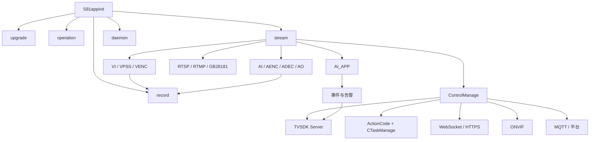

# IPC_Camera 项目接手与故障排查指导手册

> 文档定位：面向接手项目的 C/C++、嵌入式、音视频和 SDK 维护人员。
>
> 最近核对：2026-07-13，基于当前工作区源码、构建脚本和现有 ELF 产物进行只读分析。
>
> 重要说明：当前工作区不是干净发布基线，源码、生成头文件和动态库存在版本漂移。本文描述的是当前工作站快照，部署前必须再次核对目标机真实二进制。

## 1. 如何使用本手册

遇到问题时，不要先从报错所在函数局部修改，而应先确定问题属于哪一层：

1. 设备运行环境和进程生命周期。
2. 海思音视频硬件数据面。
3. IPC 业务层和 `ActionCode` 命令总线。
4. IPC TVSDK 协议适配层。
5. SDK Server 的 HTTP、路由、回调和序列化层。
6. SDK Client 的 Session、HTTP 和结构体反序列化层。
7. 发布头文件、动态库和目标机 ABI。

建议始终记录四项信息：

- 失败接口和命令码。
- 请求进入的最后一层。
- 最后一个有效结构体/JSON 的内容。
- 目标机实际加载的可执行文件和动态库 SHA256。

## 2. 项目一句话模型

`IPC_Camera` 是一套多进程网络摄像机产品工程：`stream` 进程负责音视频、AI 和控制服务；`record` 进程负责录像；SDK Server 作为动态库嵌入 `stream`；外部 NVR 通过 SDK Client 以 C 结构体调用，内部实际通过 JSON/HTTP、回调表和 IPC `ActionCode` 执行业务。



## 3. 源码目录与所有权

| 目录 | 所有权与职责 | 常见问题 |
|---|---|---|
| `Hi3516/hi3516_ipc` | Hi3516 设备应用和主进程 | 启动失败、硬件初始化、线程退出 |
| `Hi3516/hi_pipeline` | 海思 MPP/SVP/Cipher 封装 | 驱动、VB 池、bind、超时、返回码 |
| `Hi3516/share/ipc_share` | IPC 业务、Task、协议、数据库、推流 | 配置未生效、ActionCode 错配、并发状态 |
| `Hi3516/share/cam_share` | 通用媒体、live555、网络和工具 | RTSP Source/Sink、第三方封装 |
| `Hi3516/share/ai_share` | AI 推理后端和算法模块 | 模型加载、推理输出、性能 |
| `Hi3516/ipc_platform` | 目标机动态库、rootfs 和启动环境 | 部署库版本、依赖、权限 |
| `SDK/af_sdk/sdk_client` | NVR/PC 使用的 SDK Client | 登录、心跳、HTTP、回调、重连 |
| `SDK/af_sdk/sdk_server` | 嵌入设备的 SDK Server 库 | 路由、Session、回调、序列化 |
| `SDK/af_sdk/sdk_share` | Client/Server 公共协议合同 | ABI、枚举、数组上限、JSON 转换 |
| `rv1126` | RV1126 平行移植 | Hi3516 修改未同步、实现漂移 |

所有权原则：

- 海思硬件行为由 `main_app/stream_media` 和 `hi_pipeline` 负责。
- 业务配置由 `ipc_share/control/business` 负责。
- 协议结构体与 IPC 业务对象之间的映射由 `protocols/tvsdk/src/convert` 负责。
- SDK Server 的 HTTP 和 JSON 序列化由 `SDK/af_sdk/sdk_server` 与 `sdk_share/tools/convert` 负责。
- 发生 SDK 边界问题时，优先在 TVSDK/SDK 所有层修复，不要无证据修改共享业务模块。

当前 `Hi3516/output/cmake_temp` 记录的最近构建画像是 `TV-3852T + sc533hai-f4mm + PROJECT_TYPE_ITC`。关键宏包括 `CAP_RECORD_USE_MAIN_STREAM=0`、`CAP_AI_GARBAGE_DETECT=0`、`CAP_AI_PEOPLE_STATISTICS=0`、`CAP_EVENT_AUDIO_PLAYBACK_V2=0`。因此当前历史构建录制子码流，垃圾检测/人流统计等回调也不能只因为源码存在就认为已编入。该目录是历史构建证据，不是新构建参数的替代品。

## 4. 设备启动与进程模型

启动脚本：[`S81appinit`](../Hi3516/ipc_platform/environment/system/etc/init.d/S81appinit)

启动顺序：

```text
驱动和时区/RTC
    -> upgrade
    -> operation
    -> stream
    -> 延迟
    -> record
    -> daemon
```

关键进程：

| 进程 | 职责 | 与 `stream` 的关系 |
|---|---|---|
| `stream` | 音视频、AI、协议、控制业务 | 核心进程 |
| `record` | 录像封装、文件生成和索引 | 通过 `CStreamServer` 接收音视频 |
| `upgrade` | 固件升级与状态持久化 | 通过 UpgradeClient/UDS 等交互 |
| `operation` | 运维日志 | 接收业务日志 |
| `daemon` | 进程守护 | 最后启动 |

`stream` 主入口：[`stream_main.cpp`](../Hi3516/hi3516_ipc/main_app/stream_main.cpp)

当前初始化顺序：

1. 信号和日志。
2. 时区运行时。
3. `CConfigManager`。
4. `CCryptoInit`。
5. `CStreamVideo`。
6. `CStreamAudio`。
7. `CPushStream`。
8. `ControlManage`。

退出时反向释放。推流必须在音视频资源前停止，否则外部请求和媒体线程可能相互等待。

## 5. 线程模型速查

| 线程/线程组 | 创建位置 | 职责 |
|---|---|---|
| 3 个 VENC 线程 | `CStreamVideo::init()` | 主码流、子码流、JPEG 取流 |
| VPSS AI 线程 | `CStreamVideo::init()` | 每 10 帧向 AI_APP 送一帧 YUV |
| AI 音频线程 | `CStreamAudio::init()` | MIC/LINEIN PCM 采集与分发 |
| AENC 线程 | `CStreamAudio::init()` | AAC 编码取流与分发 |
| live555 事件循环 | RTSP Server 封装 | RTSP 控制和 RTP 发送 |
| SDK HTTP 线程池 | `CSdkHttpServer` | HTTP 路由，固定 16 个工作线程 |
| AlarmListen 线程占用 | SDK HTTP 线程池 | 每个长连接占用一个工作线程 |
| VoiceCom accept | `VoiceComServer` | 接受 9006 TCP 连接 |
| VoiceCom recv | `VoiceComServer` | 接收 NVR 下行音频 |
| VoiceCom capture | `VoiceComServer` | 定时拉取 MIC PCM 并回传 NVR |
| SDK Client heartbeat | `CUserSession` | Session 保活 |
| SDK Client reconnect | `CUserSession` | 断线重登录 |
| SDK Client alarm | `CClientAlarmManager` | AlarmListen 和告警解析 |

排查死锁或退出卡死时，优先检查无限等待的 MPP 取帧接口和所有 `join()` 的调用顺序。

## 6. 视频模块

### 6.1 初始化链路

入口：[`stream_video.cpp`](../Hi3516/hi3516_ipc/main_app/stream_media/video/stream_video.cpp)

```text
策略对象和 NAL Parser
    -> streamSys_init：MPP SYS + VB
    -> streamVi_init：Sensor/VI
    -> CIspControl::init：ISP
    -> streamVpss_init：VPSS
    -> streamVenc_init：Main/Sub/JPEG
    -> VENC 取流线程
    -> AI VPSS 取帧线程
    -> OSD
    -> VI/VPSS/VENC bind
```

硬件绑定：

```text
VI Pipe       -> VPSS Group
VPSS Main     -> VENC Main
VPSS Sub      -> VENC Sub
VPSS AI       -> VENC JPEG
```

### 6.2 编码帧分发

取流函数：`CStreamVideo::get_vencStream()`。

```text
mppVenc_get_stream
    -> 遍历 ot_venc_stream.pack
    -> 创建 VideoFrame_S
    -> H264/H265/SVAC3/MJPEG NAL 解析
    -> Main/Sub/JPEG ChannelHandler
```

主码流：

- 非 SVAC3 时送 RTSP/RTMP。
- 送 GB28181。
- 按设备画像决定是否送录像进程。
- GOP 过长时周期性请求 IDR。

子码流：

- 送 RTSP/RTMP。
- 按设备画像决定是否作为录像码流。

JPEG：

- 当前按两个编码数据块合并为一张图片。
- 最大图片大小 5 MB。
- 合并完成后送 `CCaptureCtrl`。

通道策略实现：[`venc_channel_handler.cpp`](../Hi3516/hi3516_ipc/main_app/stream_media/video/venc_channel_handler.cpp)

### 6.3 RTSP 数据链路

```text
ChannelHandler
    -> CPushStream::sendVideoData
    -> CRtspServer::sendVideoData
    -> 复制到有界 FrameData 队列
    -> live555 FramedSource 拉取
    -> afterGetting
    -> RTPSink
```

URL：

- `Streaming/Channels/101`：主码流。
- `Streaming/Channels/102`：子码流。

客户端未请求媒体时，RTSP 层会清理队列；队列满时丢帧。因此“VENC 正常但 RTSP 无数据”要同时检查 `request` 状态和队列。

当前普通型号每路 RTSP 仅缓存 4 个视频帧和 4 个音频帧，最大客户端数为 4。新客户端进入后会请求 IDR，并丢弃非关键帧直到 H.264 SPS 或 H.265 VPS 到来。这些设计优先保证实时性，网络抖动时会以丢帧而不是积压换延迟。

### 6.4 AI 视频分支

`get_vpssStream()` 从 VPSS AI 通道取得 YUV420：

1. 每 10 帧选择一帧。
2. 将物理内存映射到虚拟地址。
3. 调用 `algo_send_videoStreamData()`。
4. 解除映射。
5. 释放 VPSS 帧。

预览正常但 AI 无结果时，按以下顺序检查：

1. VPSS AI 通道是否成功启用。
2. `mppVpss_get_chnFrame()` 返回码。
3. 映射地址、宽高、YUV 长度。
4. 10 帧抽帧是否符合预期。
5. 算法实例和模型是否加载。
6. AI 结果是否进入事件联动层。

这条路径不是零拷贝：视频线程映射 VPSS 物理内存后，AI `CStreamHandler` 会建立自己的帧/VB 并复制一份 YUV。普通 30 fps 构建再按 10 帧抽 1 帧，约 3 fps 进入算法；若设备画像已把 VPSS AI 通道降到 2 fps，仍再除 10 会只剩约 0.2 fps。AI 检出慢时还要检查算法私有容量 2 队列是否持续丢旧帧。

### 6.5 视频配置热更新

`CStreamVideo::setVideoConfig()` 不是简单写配置，它会同步执行：

1. 比较分辨率、编码格式、视频类型、帧率。
2. 必要时重启 RTSP。
3. 停止并等待 VENC 线程。
4. 解绑 VPSS→VENC。
5. 修改 VPSS wrap、分辨率和裁剪。
6. 重置 VENC。
7. 重新绑定并启动取流线程。
8. 请求 IDR。
9. 更新 OSD、录像配置和 RTMP。

SDK 设置视频参数超时，要同步检查 VENC、VPSS、RTSP，而不只是 HTTP 日志。

另一个当前实现差异是：VENC 首次初始化会把配置码率上限乘以 0.75，而配置重置路径使用完整上限。同一份配置在冷启动和热重配后可能得到不同实际码率，分析带宽跳变时要对比 `stream_venc.cpp` 的 init/reset 两条路径。

### 6.6 录像与回放

录像不是在 `stream` 内直接写文件，而是独立 `record` 进程：

```text
VENC/AENC
  -> CStreamServer TCP 10001
  -> record::StreamClient
  -> CRecordFile queue
  -> FFmpeg remux MPEG-TS
  -> 60 秒且遇关键帧切片
  -> m3u8 索引
```

FFmpeg 当前不重新编码，只做 TS 封装并重建/修正 PTS。当前设备画像 `CAP_RECORD_USE_MAIN_STREAM=0`，所以视频录制走子码流，音频固定按 AAC/16 kHz/单声道处理。

回放主路径是查询 `/opt/course/record/<date>/normal_<date>.m3u8` 和录像时间段，再由 Nginx 映射 `/opt/course/` 提供 HLS 静态文件，不是完整的 RTSP/RTP 回放会话。出现“直播正常但回放失败”时，应检查 record 进程、10001、TS/m3u8、录像数据库和 Nginx，而不是 live555。

## 7. 音频模块

入口：[`stream_audio.cpp`](../Hi3516/hi3516_ipc/main_app/stream_media/audio/stream_audio.cpp)

### 7.1 初始化

```text
audio_config.json
    -> Audio SYS
    -> AO Speaker
    -> CStreamAo
    -> AI MIC/LINEIN
    -> AENC AAC
    -> ADEC
    -> Resample
    -> ADEC -> AO bind
    -> AI 线程
    -> AENC 线程
```

### 7.2 MIC/LINEIN 采集

`deal_aiFrame_thr()`：

1. `mppAi_getFrame()` 获取 PCM。
2. 选择 MIC 或 LINEIN。
3. 整理为单声道。
4. 软件调整输入音量。
5. 复制到 VoiceCom 回传队列。
6. 应用线程手工 `mppAenc_sendFrame()` 送 AENC。
7. 送音频 AI。
8. G711 模式下执行 16k→8k 重采样和 G711 编码。
9. 释放 AI 帧。

AI→AENC 的硬件 bind 当前被注释，原因是应用层需要先选择 MIC/LINEIN、整理单声道和调音量。这意味着“AI 有帧但 AAC 无数据”时，要检查应用线程是否成功送入 AENC，不能只查 MPP bind。

### 7.3 AAC 编码

`deal_aencFrame_thr()`：

1. 从 AENC 取得 AAC。
2. 检查 ADTS 同步字。
3. 根据 CRC 标志去掉 7 或 9 字节 ADTS。
4. 裸 AAC 送 RTSP。
5. 音频负载送录像进程。
6. 释放 AENC 帧。

### 7.4 播放和对讲

`sendAudio_to_Adec()` 支持：

| 格式 | 处理 |
|---|---|
| PCM | 直接送 AO |
| G711A | 软件解码到 PCM 后送 AO |
| G711U | 软件解码到 PCM 后送 AO |
| AAC | 送 ADEC，再由 ADEC→AO 播放 |

## 8. VoiceCom 与普通 RTP 对讲

### 8.1 VoiceCom 媒体通道

VoiceCom 使用独立 TCP 9006，不走 SDK HTTP 配置端点。

```text
[2 字节大端长度][负载]

首帧负载：VCP1 + NET_TV_VOICECOM_AUDIO_PARAM_S
后续负载：裸 PCM/G711A/G711U
```

NVR→IPC：

```text
NET_TV_StartVoiceCom
    -> NET_TV_VoiceComSendData
    -> VoiceComServer recv
    -> cb_voice_com_play
    -> CAVConfigure::setAoSpeakInfo
    -> CStreamAudio::sendAudio_to_Adec
    -> AO
```

IPC→NVR：

```text
MIC PCM
    -> CVoiceComCaptureSource
    -> cb_voice_com_capture
    -> VoiceComServer capture_loop
    -> TCP 9006
    -> VoiceComClient recv callback
```

采集缓存最大 50 帧，满后丢最旧帧。

### 8.2 对讲状态控制

`NET_TV_STATE_TALKBACK` 只负责状态：

```text
cb_set_talkback_state
    -> AC_SET_INTERCOM_INFO
    -> CPreviewManage::set_intercom_info
```

当 `strSdp == "tvsdk_voicecom"` 且 URL 为空时，Preview 层跳过 RTP Receiver，因为媒体走 VoiceCom TCP。

排查对讲问题时必须把状态面和媒体面分开验证。

## 9. 控制总线

入口：

- [`control_manage.cpp`](../Hi3516/share/ipc_share/control/control_manage.cpp)
- [`task_manage.cpp`](../Hi3516/share/ipc_share/control/task/task_manage.cpp)
- [`task.h`](../Hi3516/share/ipc_share/control/task/task.h)

`ControlManage::bind_task()` 把 ActionCode 绑定到 Task 类：

```text
AC_GET_VIDEO_CONFIG -> Task::AV::GetVideoConfig
AC_SET_VIDEO_CONFIG -> Task::AV::SetVideoConfig
AC_GET_TIME_INFO     -> Task::System::GetTimeInfo
AC_SET_TIME_INFO     -> Task::System::SetTimeInfo
...
```

执行模型：

```text
Protocol Adapter
    -> CTaskManage::execute(actionCode, Task::Info_S)
    -> 取得共享 Task 实例
    -> set_info
    -> Task::handle
    -> Business Manager
    -> result
```

注意：这不是每个请求创建一个 Task，而是每个 ActionCode 长期复用一个 Task 对象。并发执行同一 ActionCode 是当前高风险区。

## 10. SDK Client

主要代码：

- [`NetTVSDKClientInterface.cpp`](../SDK/af_sdk/sdk_client/src/interface/NetTVSDKClientInterface.cpp)
- [`DeviceManage.cpp`](../SDK/af_sdk/sdk_client/src/core/DeviceManage.cpp)
- [`UserSession.cpp`](../SDK/af_sdk/sdk_client/src/core/UserSession.cpp)
- [`CommandExecutor.h`](../SDK/af_sdk/sdk_client/src/core/CommandExecutor.h)
- [`ClientAlarmManager.cpp`](../SDK/af_sdk/sdk_client/src/core/ClientAlarmManager.cpp)
- [`VoiceComClient.cpp`](../SDK/af_sdk/sdk_client/src/core/VoiceComClient.cpp)

登录：

```text
NET_TV_Init
    -> NET_TV_Login
    -> CDeviceManage::Login
    -> CUserSession::ConnectAndLogin
    -> POST /TVAPI/V1.0/Basic/Login
    -> 保存 SessionId
    -> 启动心跳
    -> GET /Device/GetInfo
```

配置接口：

```text
NET_TV_GetDevConfig<T>
    -> CommandExecutor::ExecuteGet<T>
    -> HTTP GET
    -> SDKConvert::to_respStruct

NET_TV_SetDevConfig<T>
    -> SDKConvert::to_string
    -> CommandExecutor::ExecuteSet<T>
    -> HTTP POST
```

SDK Client 的 C 结构体只是一层公开接口，真实传输仍是 JSON/HTTP。

### 10.1 Client 当前行为和排障陷阱

- `NET_TV_Logout()` 只停止并删除本地 `CUserSession`，没有调用服务端 `/Basic/Logout`。服务端 Session 通常还会残留约 5～10 分钟，所以客户端数量不会立即下降。
- 登录成功但后续 `GetDeviceInfo` 失败时，清理路径同样只做本地 Logout，设备侧也可能留下 Session。
- `SendRequest()` 持有 `cmdMutex_` 发命令；收到 401 后，它在锁内启动并等待 `ReconnectLoop`，而重连也需要同一把锁。当前请求通常会等待约 30 秒后失败，所谓“401 后透明重试”不能可靠完成。
- 普通业务路由的 401 主要表示 HTTP Digest 失败，并不等同于 SDK Session 过期；重新登录未必能解决账号、密码或 Digest 参数错误。
- `ClientAlarmManager::Stop()` 在阻塞 `recv()` 无法中断时会 detach 告警线程。若对象随后析构，旧线程仍可能访问 `this`，要把随机退出崩溃、重复监听和 use-after-free 纳入排查。
- SDK 告警回调运行在接收线程，结构体和图片缓冲只在回调期间有效。回调里不要直接 Logout、StopListen 或 Cleanup，建议复制必要数据后投递到业务线程。

## 11. SDK Server

主要代码：

- [`NetTVSDKServerInterface.cpp`](../SDK/af_sdk/sdk_server/src/interface/NetTVSDKServerInterface.cpp)
- [`NetTVSDKServerImpl.cpp`](../SDK/af_sdk/sdk_server/src/interface/NetTVSDKServerImpl.cpp)
- [`SdkHttpServer.cpp`](../SDK/af_sdk/sdk_server/src/service/SdkHttpServer.cpp)
- [`RouteModule.cpp`](../SDK/af_sdk/sdk_server/src/interface/modules/RouteModule.cpp)
- [`DeviceConfigBusiness.h`](../SDK/af_sdk/sdk_server/src/business/DeviceConfigBusiness.h)
- [`NetTVConfigCb.c`](../SDK/af_sdk/sdk_server/src/cb/config/NetTVConfigCb.c)

SDK Server 不是独立进程，而是 `libNetTVSDKServer.so`，由 IPC `stream` 加载。

初始化：

```text
NET_TV_SERVER_Init
    -> CNetTVSDKServerImpl::DoInit
    -> SessionModule 设置鉴权
    -> RouteModule 注册路由
    -> ServerModule 启动 HTTP
```

主要端点：

| URL | 方法 | 功能 |
|---|---|---|
| `/TVAPI/V1.0/Basic/Login` | POST | 登录 |
| `/TVAPI/V1.0/Basic/KeepLive` | GET | 心跳 |
| `/TVAPI/V1.0/Device/GetInfo` | GET | 设备信息 |
| `/TVAPI/V1.0/Device/Capability` | GET | 能力集 |
| `/TVAPI/V1.0/Device/GetDevConfig` | GET | 获取配置 |
| `/TVAPI/V1.0/Device/SetDevConfig` | POST | 设置配置 |
| `/TVAPI/V1.0/Event/AlarmListen` | GET | 告警长连接 |

HTTP Server 固定使用 16 线程池。每个 AlarmListen 长连接长期占用一个线程，压力测试需要同时覆盖告警订阅和短命令。

### 11.1 鉴权与 Session 的真实边界

普通业务路由由 `CHttpBasicCommand` 统一执行 Basic/Digest 鉴权，但不校验 `session_id`。Session 当前主要用于 KeepLive、AlarmListen、在线客户端统计和告警队列，不应把它理解成所有业务请求的授权令牌。

- Login、Logout 和普通业务接口执行 HTTP 鉴权。
- KeepLive、AlarmListen 主要按 URL 中的 `session_id` 查 Session。
- Session ID 是 `session_` 加六位随机数，并通过明文 HTTP URL 传递。
- 当前 HTTP 服务不是 HTTPS；Basic 只有 Base64，Digest 也不能替代链路加密。
- `NET_TV_SERVER_Cleanup()` 只清理 SDK HTTP 主体，不会自动停止独立的 VoiceCom/RecordFrame Server；关闭时应显式停止独立服务。

### 11.2 告警队列和线程池容量

每个告警订阅占用一个 httplib worker。16 个长连接可以耗尽 16 线程池，使登录和配置请求排队。每 Session 告警队列上限是 100 条而不是 100 字节/固定内存；图片仍以 Base64 放在 JSON 中，一条人脸/AI 告警可能达到数 MB，多客户端时会复制多份大 JSON。压力测试必须同时记录 Session 数、队列长度、单条消息字节数和进程 RSS。

### 11.3 同进程二次初始化

路由宏使用函数内静态 registrar。第一次 Cleanup 会清空 Registry，但第二次 Init 不会重新构造这些静态对象，可能只剩 Session 特殊路由和显式注册的 Upload 路由。典型表现是“第一次正常，Cleanup 后第二次 Init 大量业务接口 404”。当前应避免在同一进程反复 Init/Cleanup，并把实际 Registry 数量作为诊断依据。

## 12. IPC TVSDK 适配层

主要文件：

- [`tvsdk_server.cpp`](../Hi3516/share/ipc_share/protocols/tvsdk/src/tvsdk_server.cpp)
- [`tvsdk_callbacks.cpp`](../Hi3516/share/ipc_share/protocols/tvsdk/src/callbacks/tvsdk_callbacks.cpp)
- [`tvsdk_convert.cpp`](../Hi3516/share/ipc_share/protocols/tvsdk/src/convert/tvsdk_convert.cpp)
- [`NetTVSDKServer.h`](../Hi3516/share/ipc_share/protocols/tvsdk/include/NetTVSDKServer.h)

初始化：

1. 从 IPC 用户管理读取管理员账号密码。
2. 在 9008 初始化 SDK HTTP Server。
3. 注入 `CTaskManage`。
4. 注册所有 TVSDK 回调。
5. 启动 VoiceCom 9006。
6. 启动设备发现。

TVSDK Adapter 的职责应限制为：

- SDK 结构体与 IPC 业务结构体转换。
- SDK command 与 ActionCode 映射。
- SDK 错误码与 IPC 返回码映射。
- 告警结构体构造和 SDK 推送。

它不应复制业务规则，也不应直接拼接 SDK HTTP JSON。

## 13. 一条完整 GET 链路

以 NTP 为例：

```text
NVR
  -> NET_TV_GetDevConfig(command=NET_TV_GET_NTPCFG)
  -> NetTV_GetDevConfig_Impl<NET_TV_SYSTEM_NTP_INFO_S>
  -> GET /Device/GetDevConfig?Command=110
  -> CDeviceConfigBusiness::GetDevConfig
  -> HandleGetConfig<NET_TV_SYSTEM_NTP_INFO_S>
  -> NetSDK_ExecuteCb_GetDevConfig
  -> cb_get_ntp_cfg
  -> execute_get_result(AC_GET_TIME_INFO)
  -> Task::System::GetTimeInfo
  -> CTimeManage::get_time_info
  -> time.json
  -> ResultCallback JSON
  -> TvSdkConvert::FillSystemNtpInfo
  -> SDKConvert::to_respString
  -> Client SDKConvert::to_respStruct
  -> NVR 输出结构体
```

GET 的四个关键检查点：

1. IPC Task 返回的 JSON。
2. `TvSdkConvert` 填充后的 SDK 结构体。
3. SDK Server 序列化后的 HTTP Body。
4. SDK Client 反序列化后的调用方结构体。

## 14. 一条完整 SET 链路

以视频编码为例：

```text
NVR NET_TV_SetDevConfig
  -> SDKConvert::to_string(NET_TV_VIDEO_ENCODE_OPTION_S)
  -> POST /Device/SetDevConfig
  -> HandleSetConfig<NET_TV_VIDEO_ENCODE_OPTION_S>
  -> NetSDK_ExecuteCb_SetDevConfig
  -> cb_set_stream_cfg
  -> TvSdkConvert::ToVideoConfig
  -> AC_SET_VIDEO_CONFIG
  -> Task::AV::SetVideoConfig
  -> CAVConfigure::set_configure
  -> CStreamVideo::setVideoConfig
  -> RTSP/VPSS/VENC 重配置
  -> 配置持久化
```

当前多数 SET 回调只验证 `CTaskManage::execute()` 是否成功分发，没有把 Task 内部业务返回值传回 SDK。出现“接口返回成功但配置不生效”时必须检查业务返回值和持久化结果。

## 15. 告警推送

```text
AI/普通事件
  -> EventLinkage
  -> EventLinkageDict
  -> NET_TV_ALARM_*_INFO_S
  -> ControlManage::tvsdk_push_alarm
  -> CTvSdkServer::push_alarm
  -> NET_TV_SERVER_PushAlarmInfo
  -> AlarmModule
  -> Session 队列
  -> AlarmListen
  -> CClientAlarmManager
  -> 应用告警回调
```

当前行为：

- TVSDK 无在线客户端时不推送。
- `bEventEnded == true` 的结束事件不推送。
- 基础、规则、AI 目标、统计、人脸比对等使用不同固定结构体。
- 图片长度、固定数组上限和结构体 ABI 必须一致。

## 16. 端口、URL、配置和日志

### 16.1 常用端口

| 功能 | 默认值 |
|---|---:|
| IPC SDK HTTP | 9008 |
| VoiceCom | 9006 |
| SDK config Demo | 9888，仅 Demo |
| RTSP | 由 RTSP 配置决定，路径为 101/102 |

### 16.2 关键配置

| 配置 | 设备路径 |
|---|---|
| 视频 | `/opt/cam/.config/user_data/video_config.json` |
| 视频能力集 | `/opt/cam/.config/user_data/video_capability_set.json` |
| 音频 | `/opt/cam/.config/user_data/audio_config.json` |
| 时间/NTP | `/opt/cam/.config/user_data/time.json` |

### 16.3 常用运行检查

```bash
pidof stream record upgrade operation daemon
ss -lntp | grep -E '9008|9006|554'
readelf -d /opt/cam/bin/stream | grep NEEDED
sha256sum /opt/cam/bin/stream
sha256sum /opt/cam/lib/libNetTVSDKServer.so
cat /proc/$(pidof stream)/maps | grep NetTVSDK
```

## 17. 已确认的高风险点

### P0：SDK 合同和二进制版本漂移

当前存在：

- SDK 源码公共头。
- SDK build 生成头。
- IPC 自带 `NetTVSDKServer.h`。
- IPC 平台部署 `libNetTVSDKServer.so`。
- SDK build 目录内不同平台的历史 `.so/.a`。

其中 `RegisterCb_GetDeviceInfo` 已出现值传递和指针传递不一致，IPC 侧使用 `reinterpret_cast` 绕过类型检查。必须把头文件和 `.so` 统一到同一次构建。

当前还存在一个明确的构建漂移信号：`Hi3516/hi3516_ipc/main_app/CMakeLists.txt` 中 `libNetTVSDKServer` 链接项处于注释状态，但现有 `Hi3516/output/bin/stream` 的 ELF `NEEDED` 仍包含 `libNetTVSDKServer.so`。这说明现有二进制不能代表当前 CMake 能从干净目录复现；接手后应把“干净交叉编译 + readelf 依赖核对”列为第一批基线任务。

当前两个 Hisi32 Server SO 也已确认不是同一版本：

| 文件 | SHA256 | `NET_TV_SERVER_*` 导出数 |
|---|---|---:|
| `Hi3516/ipc_platform/lib/tvsdk/lib/libNetTVSDKServer.so` | `8062B58C...C95DA15A` | 189 |
| `SDK/af_sdk/build/server/lib_hisi32/libNetTVSDKServer.so` | `2377EB07...43B0FCB` | 195 |

平台库比当前 SDK build 库少 6 个导出：DeviceControl 注册，以及 RecordFrame 的 Start/Stop Server 和 Start/Read/Stop callback 注册。IPC 本地 `NetTVSDKServer.h` 与 SDK 生成 Server 头的 SHA256、大小也不同。接口新增或替库时必须整套同步“源头公共头 + Server 接口头 + 合并发布头 + Hisi32 SO + IPC callback + stream”，不能只复制其中一个文件。

### P0：音视频帧 `malloc`/`delete` 混用

`VideoFrame_S` 和 `AudioFrame_S` 使用柔性数组，当前创建使用 `malloc`，释放使用 `delete`，属于未定义行为。长时间运行后的随机堆损坏应优先检查这里。

### P0：同一 ActionCode 并发请求共享 Task 状态

每个 ActionCode 复用同一 Task 实例，`set_info()` 会覆盖成员数据，`handle()` 在锁外执行。`Task::Info_S` 的排序只比较 requester，同类并发请求可能合并、串包或超时。

### P0：SET 返回值未完整传播

协议层可能返回 SDK 成功，但业务层实际设置失败。判断设置是否成功必须同时验证：

- Task 业务返回码。
- 配置文件内容。
- 硬件状态。
- 重启后的配置。

### P0：TVSDK 网络配置和音频能力 JSON 信封错误

`execute_get_result()` 返回的是带 `Return/Data` 的完整信封，但 `cb_get_network_cfg()` 和 `cb_get_audio_encode_cap()` 直接把完整 JSON 转业务结构，没有像大多数 GET 一样先提取 `Data`，可能表现为接口成功但字段全零。

`cb_set_network_cfg()` 又把业务 JSON 直接放入 `Task::Info_S::data`，没有包装成 `{"Data": ...}`；而 `CTask::set_info()` 固定从 `Data` 取业务内容。因此网络 SET 可能进入 Task 但拿到空数据。网络配置会影响设备可达性，修复前不要只凭 SDK 返回码在远程设备上批量下发。

### P0：当前 TVSDK 升级链路在 IPC Task 层被硬编码失败

`Task::System::SetUpgrade::handle()` 固定返回 `ERR_IMPORT_UPGRADE`，`CheckUpgrade::handle()` 固定返回 `ERR_CHECK_UPGRADE`。TVSDK `cb_set_upgrade()` 又会依次等待 Set、Check 成功后才执行 `AC_DO_UPGRADE`，所以当前源码按设计无法走完整升级。

此外 TVSDK 回调和 `DoUpgrade` 都可能添加本地目录前缀，存在 `/opt/course/upload//opt/course/...` 一类双重路径风险。排查升级时先确认这两个 Task 和最终绝对路径，不要先归因于闭源 SDK 或 upgrade 进程。

### P1：音频线程启动竞态

当前音频线程创建后才设置运行标志。新线程可能先读取到 `false` 并退出，表现为偶发启动无音频。

### P1：重采样 vector 只 reserve 未 resize

C 接口向逻辑大小为 0 的 vector 存储区写数据，存在容器生命周期风险。

### P1：无限等待导致退出卡死

AI 和 VPSS 的部分 MPP 取帧使用 `-1` 无限等待，退出时仅修改标志并 `join()`。硬件异常时线程可能无法退出。

### P1：SDK 单例不能可靠二次初始化

`CSingleton` 使用 `call_once`，`DestroyInstance()` 不重置 `once_flag`。Client Cleanup 后再次 Init 可能无法重建实例。

### P1：SDK 路由二次初始化风险

路由宏使用静态注册器，Cleanup 清空路由 vector 后，再次 Init 不一定重新执行静态构造。

### P1：SDK Session、告警线程和内存上限

- Client Logout 不通知 Server，Session 和客户端计数会延迟清理。
- AlarmListen 每连接占一个 16 线程池 worker。
- 每 Session 最多缓存 100 条告警，但不限制总字节数；Base64 图片会显著放大内存。
- Client 告警线程在阻塞时可能 detach，存在对象析构后的访问风险。
- 401 重连路径存在 `cmdMutex_` 互相等待，可能固定等待约 30 秒。

### P1：超时设置 API 返回值错误

`NET_TV_SetRevTimeOut()` 和 `NET_TV_SetConnectTime()` 设置完成后仍返回 `FALSE`；Exception Callback 当前未实现。

### P1：VoiceCom 安全与调试残留

- TCP 9006 未与 SDK HTTP Session 绑定。
- 只允许一个连接，新连接关闭旧连接。
- 当前会将 NVR 下行数据写入 `/tmp/tvsdk_voicecom_nvr_recv.pcm`。
- dump 路径逐帧 `fflush()`，生产环境需评估性能和隐私。

### P1：TVSDK 已实现但未接通的接口

- Wi-Fi STA 设置/连接/断开、4G GET/SET、热点 SET 的 callback 函数已经实现，IPC ActionCode 也已绑定，但 `register_all()` 没有注册它们，客户端请求无法到达 IPC。
- `AC_TO_STREAM_TALKBACK`、`AC_FROM_STREAM_TALKBACK`、`AC_REPLAY_TALKBACK` 被 TVSDK callback 调用，但 `ControlManage::bind_task()` 没有绑定对应 Task，这三条接口会直接执行失败。
- `cb_get_stream_cfg()` 当前固定选择 `NET_TV_LIVE_STREAM_INDEX_MAIN`，无法按调用方意图获取子码流；SET 虽支持主/子码流，GET/SET 语义并不对称。
- `register_all()` 忽略大多数 `NET_TV_SERVER_RegisterCb_*` 的 BOOL 返回值，动态库版本过旧或重复注册时只能从客户端“不支持”和零散日志反推。

### P1：大告警结构的栈和所有权边界

普通、周界、人脸告警结构内部直接包含 MiB 级图片数组。多数事件链已改用堆分配，但 `face_compare_sdk_event_publisher.cpp` 仍在栈上声明 `NET_TV_ALARM_FACE_COMPARE_INFO_S`，在小栈工作线程中有栈溢出风险。当前代码还假设 `NET_TV_SERVER_PushAlarmInfo()` 返回前已复制所有数据；闭源库升级时必须重新确认缓冲区所有权。

### P1：音视频资源、线程和重配置风险

| 风险 | 当前代码特征 | 典型症状 |
|---|---|---|
| MPP RAII 只释放 wrapper | VI/VENC deleter 未完整执行 `stream*_uninit` | 重新初始化失败、通道残留 |
| 视频初始化失败回滚不完整 | 部分 init 失败直接返回，deinit 仍可能 unbind 空句柄 | 启动失败后再次崩溃 |
| AO reboot 悬空指针 | `streamAo_reboot` 按值接收并释放旧 handle，调用方仍保留旧地址 | VoiceCom 8k/16k 切换后崩溃/无声 |
| AAC 与 ADEC 配置冲突 | ADEC 初始化强制 G711A/8k，但 AAC 播放分支仍向它送 AAC | AAC 对讲/广播无声 |
| VENC SVC/ROI 条件疑似反向 | 条件接近 `MJPEG != codec && JPEG == codec` | H.264/H.265 SVC/ROI 不生效 |
| 全视频链共享发送锁 | 3 个 VENC 线程和 AI 线程共用 `m_mutexSendData`，锁内含网络发送和 YUV copy | 单一慢消费者拖住全部码流 |
| live555 销毁未 join | event-loop join 被注释，随后释放 session/env/scheduler | RTSP 热重启偶发 UAF |
| RTSP 状态只用 `volatile` | `request/requestIFrame` 跨线程但非原子 | 偶发不出帧或 I 帧门控异常 |
| MPP VENC 错误路径泄漏 | pack 分配后 vendor get/release 失败可提前返回 | 错误风暴后内存持续上涨 |
| legacy RTP 固定剥 12 字节 | 不处理 CSRC、extension、padding、乱序，短包还可能长度下溢 | 普通 RTP 对讲杂音/崩溃 |
| record 空队列退出 | worker 永久阻塞 pop，析构只改标志后 join | record 停机/升级时卡死 |
| 录像无源 PTS | stream 只传编码负载，record 通过计数/单调时钟重建 PTS | 长稳 A/V 漂移、断流恢复跳时 |

`CStreamVideo::init()` 对 ISP、VPSS、AI、OSD 的部分返回值也没有完整检查，不能把“主 init 返回成功”直接等同于所有子模块已工作。

## 18. 按症状排查

| 现象 | 第一检查点 | 重点文件 |
|---|---|---|
| SDK 登录失败 | 9008、账号、Digest、Session | `UserSession.cpp`、`SessionManager.cpp` |
| Login 后 GetInfo 失败 | DeviceInfo 回调 ABI | IPC/SDK 两份 `NetTVSDKServer.h` |
| GET 成功但全零 | Task JSON、转换、SDK serializer | `tvsdk_callbacks.cpp`、`tvsdk_convert.cpp`、`DeviceConfigBusiness.h` |
| GET 等 5 秒 | 同 ActionCode 并发、Task 未 result | `task_manage.cpp`、`task.cpp` |
| SET 成功但没生效 | 业务返回值未传播 | 对应 Task、Business、配置文件 |
| 设置视频超时 | VENC join、RTSP reboot、bind | `stream_video.cpp` |
| RTSP 黑屏 | VENC、IDR、request、queue | `stream_video.cpp`、`rtsp_server.cpp` |
| RTSP 无音频 | AI/AENC/ADTS/客户端音频请求 | `stream_audio.cpp` |
| 启动偶发无音频 | 线程和运行标志顺序 | `CStreamAudio::init()` |
| VoiceCom 下行无声 | 9006、参数、play callback、AO | `VoiceComServer.cpp`、`tvsdk_server.cpp` |
| VoiceCom 上行无声 | MIC、50 帧队列、capture callback | `voice_com_capture_source.cpp` |
| VoiceCom 切换采样率后崩溃 | AO reboot 悬空句柄 | `stream_ao.cpp`、`stream_audio.cpp` |
| 告警不推送 | 在线客户端、结束事件过滤、AlarmListen | `event_linkage_dict.cpp`、`AlarmModule.cpp` |
| Wi-Fi/4G/热点接口不进入 IPC | callback 已实现但未注册 | `tvsdk_callbacks.cpp::register_all` |
| 网络 GET 全零或 SET 不生效 | `Data` 信封缺失/未提取 | `cb_get_network_cfg`、`cb_set_network_cfg` |
| 音频能力全零 | 完整信封直接反序列化 | `cb_get_audio_encode_cap` |
| 升级第一步就失败 | Set/Check Task 固定返回错误 | `system_task.cpp`、`cb_set_upgrade` |
| RTSP 热重启偶发崩溃 | live555 事件线程未 join | `rtspServer_base.cpp` |
| record 退出卡死 | queue pop 未被唤醒 | `record_file.cpp` |
| 长时间录像音画漂移 | PTS 在 record 侧重构 | `stream_server.cpp`、`ffmpeg_record.cpp` |
| 回调后崩溃 | 结构体 ABI 和 SDK 序列化 | `DeviceConfigBusiness.h`、`SDKConvert` |
| 只在设备崩溃 | 运行库与源码不一致 | `/proc/pid/maps`、SHA256、ELF ABI |

## 19. SDK 和设备构建

### 19.1 设备构建

真实入口：[`Hi3516/ipc_platform/build/build.sh`](../Hi3516/ipc_platform/build/build.sh)

构建依赖 `DEVICE_TYPE`、`SENSOR_TYPE` 和可选 `PROJECT_TYPE`。设备画像会生成大量 `CAP_*` 宏，决定音频输入输出、分辨率、AI、Wi-Fi、4G 等能力。

仓库根目录的 `build.sh` 当前是 gzip/tar 内容，不是可直接执行的普通脚本，不应作为设备构建入口。

### 19.2 SDK 构建

入口：[`SDK/af_sdk/build/build.sh`](../SDK/af_sdk/build/build.sh)

必须从 `SDK/af_sdk/build` 目录执行，因为脚本使用 `pwd` 计算路径：

```bash
cd /mnt/e/Code/IPC_Camera/SDK/af_sdk/build
./build.sh server hisi32
./build.sh client linux64
```

交付注意：

- 不要整体复制 `build/output/bin`，其中可能混合多个架构。
- `all` 不包含 Hisi。
- `build.sh` 当前引用的 `toolchain-aarch64.cmake` 和 `toolchain-win64.cmake` 不存在，`64`/`win64` 不能仅凭历史产物宣称可复现。
- Server 的 win64 路径仍无条件定义 Linux 并链接 `pthread`/`dl`，需要单独修正和验证。
- 打包脚本对部分缺失文件使用 `|| true`，不能只相信成功提示。
- 头文件和动态库必须在同一次构建中生成。
- 静态库使用者还需匹配 OpenSSL、pthread、dl、libstdc++ ABI。
- Demo 多数直接编译 SDK 源码，不验证发布 `.so`。

## 20. 新增或修改 TVSDK 配置接口的标准流程

1. 确认 SDK command 是否已存在。
2. 确认公共 SDK 结构体和枚举。
3. 确认 Client `NET_TV_Get/SetDevConfig` 类型分派。
4. 确认 Server `DeviceConfigBusiness` 类型分派。
5. 确认 `NetTVConfigCb.c` command 回调表。
6. 确认 Server 注册 API。
7. 在 IPC `register_all()` 注册回调。
8. 在 `tvsdk_callbacks.cpp` 映射到正确 ActionCode。
9. 在 `tvsdk_convert.cpp` 完成双向字段转换。
10. 确认 `ControlManage::bind_task()` 已绑定 ActionCode。
11. 确认 Task 调用正确 Business。
12. 确认 Business 更新运行态并持久化。
13. 重新生成 Client/Server 公共头。
14. 同次构建 SDK Hisi32 库和 IPC `stream`。
15. 做 GET 默认值、SET、GET 回读、重启回读和并发测试。

严禁只修改一个同名头文件或只替换 `.so`。

## 21. 建议的接手计划

### 第一阶段：冻结基线

- 记录 Git SHA、分支和工作区状态。
- 保存当前设备 `stream` 和 `libNetTVSDKServer.so` SHA256。
- 记录目标机工具链、libc 和 OpenSSL ABI。
- 确认当前设备型号、Sensor 和 Project Type。

### 第二阶段：可复现构建

- 从干净目录构建 Hi3516 `stream`。
- 构建 SDK Server Hisi32 和 Client linux64。
- 生成头和库发布清单。
- 对比导出符号和 NEEDED 依赖。

### 第三阶段：最小烟测

- 启动和退出 `stream`。
- SDK 登录、心跳、注销。
- NTP GET/SET/重启回读。
- 视频 GET/SET 和 RTSP 主子码流。
- 音频 RTSP。
- VoiceCom 双向。
- AlarmListen 和一种基础告警。
- 录像和回放。

### 第四阶段：自动化

- SDK HTTP 接口测试。
- `CTaskManage` 同命令并发测试。
- SDK/IPC 结构体 ABI 静态检查。
- 音视频硬件在环 smoke test。
- 告警结构体和图片长度测试。

## 22. 推荐阅读顺序

1. [`pasted-test.txt`](../pasted-test.txt)
2. [`stream_main.cpp`](../Hi3516/hi3516_ipc/main_app/stream_main.cpp)
3. [`stream_video.cpp`](../Hi3516/hi3516_ipc/main_app/stream_media/video/stream_video.cpp)
4. [`stream_audio.cpp`](../Hi3516/hi3516_ipc/main_app/stream_media/audio/stream_audio.cpp)
5. [`push_stream.cpp`](../Hi3516/share/ipc_share/push_stream/push_stream.cpp)
6. [`control_manage.cpp`](../Hi3516/share/ipc_share/control/control_manage.cpp)
7. [`task_manage.cpp`](../Hi3516/share/ipc_share/control/task/task_manage.cpp)
8. [`tvsdk_server.cpp`](../Hi3516/share/ipc_share/protocols/tvsdk/src/tvsdk_server.cpp)
9. [`tvsdk_callbacks.cpp`](../Hi3516/share/ipc_share/protocols/tvsdk/src/callbacks/tvsdk_callbacks.cpp)
10. [`tvsdk_convert.cpp`](../Hi3516/share/ipc_share/protocols/tvsdk/src/convert/tvsdk_convert.cpp)
11. [`NetTVSDKClientInterface.cpp`](../SDK/af_sdk/sdk_client/src/interface/NetTVSDKClientInterface.cpp)
12. [`DeviceConfigBusiness.h`](../SDK/af_sdk/sdk_server/src/business/DeviceConfigBusiness.h)
13. [`NetTVConfigCb.c`](../SDK/af_sdk/sdk_server/src/cb/config/NetTVConfigCb.c)
14. [`SdkHttpServer.cpp`](../SDK/af_sdk/sdk_server/src/service/SdkHttpServer.cpp)

## 23. 现有详细资料

- [`IPC_CAMERA_AI_PROJECT_CONTEXT.md`](IPC_CAMERA_AI_PROJECT_CONTEXT.md)：供 Claude、Codex 等 AI 快速建立项目边界、调用链和检索策略。
- [`project-full-code-walkthrough-hi3516-sdk.md`](project-full-code-walkthrough-hi3516-sdk.md)：完整代码解读。
- [`hi3516_audio_video_development_guide.md`](hi3516_audio_video_development_guide.md)：音视频实现细节。
- [`sdk-ipc-tvsdk-interface-reference.md`](sdk-ipc-tvsdk-interface-reference.md)：SDK/TVSDK 接口和结构体参考。
- [`sdk-alarm-push-chain.md`](sdk-alarm-push-chain.md)：告警推送链路。
- [`SDK Client手册.md`](SDK%20Client手册.md)：SDK Client 使用说明。

本手册负责“接手、定位和决策”，上述文档负责进一步展开具体接口和字段。
